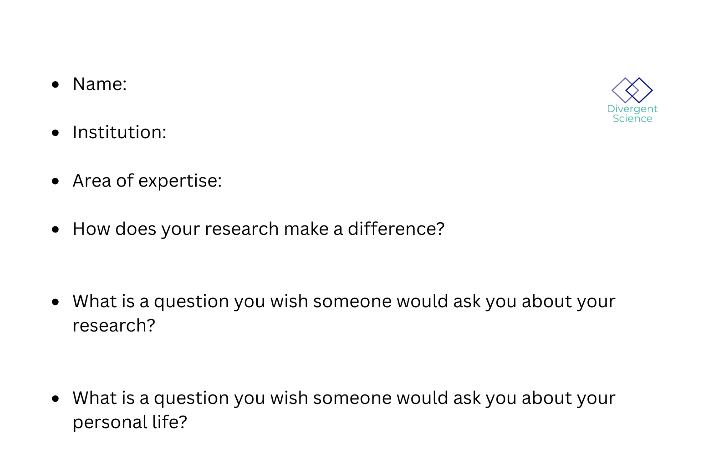
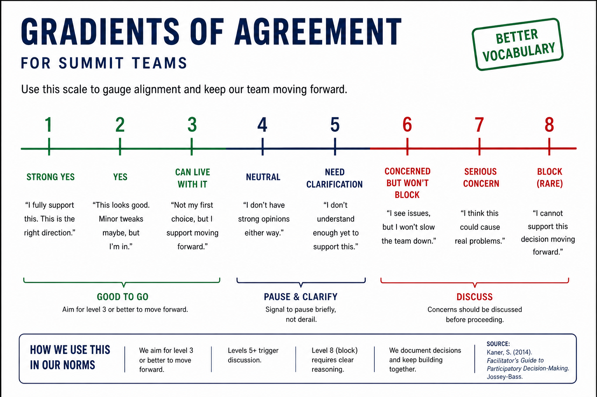
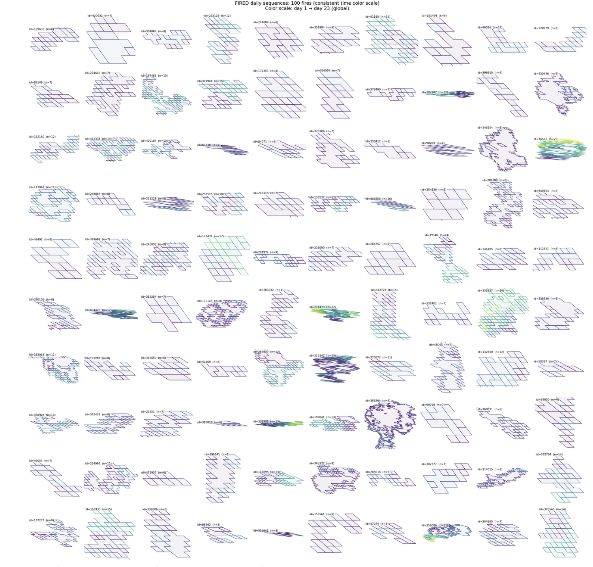

# Using AI to Assess Community Response to Climate Hazards

!!! note "Day 1 directions"
    Change the title to the name of your project.
    [Edit Day 1 setup in Markdown](https://github.com/CU-ESIIL/Project_group_OASIS/edit/main/docs/index.md?plain=1#L21){ .md-button target="_blank" rel="noopener" }

!!! tip "For ESIIL staff"
    Group Number: 2
    
    Breakout Room #: (To be assigned by ESIIL Staff)
    [ESIIL staff edit in Markdown](https://github.com/CU-ESIIL/Project_group_OASIS/edit/main/docs/index.md?plain=1#L28){ .md-button target="_blank" rel="noopener" }

!!! note "How to replace the image above"
    Upload an image that represents your project and welcome people to your page.
    
    Upload your own image to `docs/assets/hero/` and replace the file named `hero.png`. Use a wide image if you can, then refresh the site preview to check how it looks.
    Keep the file path `docs/assets/hero/hero.png` if you want the Markdown above to keep working.
    [Open image folder for changing image](https://github.com/CU-ESIIL/Project_group_OASIS/tree/main/docs/assets/hero){ .md-button target="_blank" rel="noopener" }

[See a completed example](example.md){ .md-button }

## People { #people .oasis-report-out-context }

!!! note "Day 1 task"
    Get to know your team: share your cards (5-7 mins). Update your team roster (2-3 min).
    Use the in-person name cards to guide quick introductions.
    | Name card prompts | Follow-up notes |
    |---|---|
    |  |  |
    [Edit People in Markdown](https://github.com/CU-ESIIL/Project_group_OASIS/edit/main/docs/index.md?plain=1#L63){ .md-button target="_blank" rel="noopener" }

| Name | Affiliation | Contact | Github |
|---|---|---|---|
| Bridger | NSF ASCEND Engine | bridger@innosphere.org | @Innosphere-Bridger |
| Lauren Palermo | CU Boulder / USGS | lapa5054@colorado.edu | @palermolauren |
| Lise St. Denis | CU Boulder / CIRES Earth Lab | lise.st.denis@colorado.edu | @lisestdenis |
| Juan P. Maestre | University of Texas at Austin | juanpedro.maestre@utexas.edu | @drMaestre |

## Team Norms and Decision Making { #team-norms-and-decision-making }

!!! note "Day 1 task"
    Suggested Self-Facilitation Instructions:
    
    - Round Robin: Everyone shares 1 norm that they think will be important for their team during the Summit and perhaps following the Summit (2 min).
    - After everyone has shared, make a list with as many norms as possible in GitHub (5-7 min).
    - Vote on your top 3 ideas. (Each person gets 3 votes; you can use all your votes on 1 idea or spread them out) (2 min).
    - In GitHub, move all team norms with votes to the top of the list.
    | Gradients of agreement | 
    |---|
    |  | 
    [Edit Team Norms in Markdown](https://github.com/CU-ESIIL/Project_group_OASIS/edit/main/docs/index.md?plain=1#L87){ .md-button target="_blank" rel="noopener" }

Our team norms:

- You can always pass
- Create a space where everyone feels comfortable contributing
- There are no dumb questions
- "Yes and" language
- Self-organizing around what everyone is interested in
- Be explicit with requests
- Be clear about brainstorming versus action
- Use summaries to refine into action steps

Our decision making strategy:

Silent voting is used for prioritization (everyone has the same number of votes). We clarify intensity of opinion before decisions. We operate with general comfort around AI-assisted generation, with explicit boundaries around documentation, domain expertise, and validation beyond visual checks.

## Our product(s) 📣 { #product-direction .oasis-report-out-section .oasis-report-out-day2 }

!!! note "Day 2 Tasks"
    Morning Focus: questions, hypotheses, context; add at least one visual (photo of whiteboard/notes)
    Afternoon Focus: try a few datasets and analyses. Keep it visual, keep it simple. Update the site to reflect what you test.
    [Edit content below here in Markdown](https://github.com/CU-ESIIL/Project_group_OASIS/edit/main/docs/index.md?plain=1#L106){ .md-button target="_blank" rel="noopener" }

Short term: An AI-assisted thematic analysis pipeline applied to Twitter data from the Chetco Bar (2017) and Klondike (2018) wildfires, comparing communication patterns between community members and emergency management personnel, and comparing LLM-generated themes against human-coded themes.

Long term:

- Extend the pipeline to new fire events in Colorado (Turner Gulch, Marshall, Lower North Fork) to test generalizability
- Characterize convergence and divergence in fire narratives across formal and informal communicator groups
- Develop a reproducible, prompt-engineered workflow for crisis communication analysis that other researchers can apply

*Morning whiteboard or notes showing the question, hypotheses, and context we used to start Day 2.*

## Our question(s) 📣 { #project-question .oasis-report-out-section .oasis-report-out-day2 }

Our working question:

How do AI-generated thematic analyses of social media compare to human-coded analyses in characterizing the convergence and divergence between community member and emergency management narratives during wildfire events?

What would count as progress:

Identifying at least one dimension of systematic convergence and one of systematic divergence between community and emergency management Twitter communications; producing a reproducible prompt-engineered coding pipeline that yields interpretable, consistently labeled themes across fire events; and successfully applying that pipeline to a held-out fire dataset.

## Hypotheses/Intentions

We expect that emergency management communication will cluster around operational and spatial information functions, while community communication will cluster around emotional, accountability, and proximity-driven themes. We further hypothesize that AI-assisted thematic coding with high prompt specificity will produce greater convergence with human-coded themes than lightly engineered prompts, and that theme distributions will shift meaningfully between fires depending on geographic, demographic, and policy context.

## Why this matters (the "upshot") 📣 { #why-this-matters .oasis-report-out-section .oasis-report-out-day2 }

This matters because:

Crisis communication failures during wildfire events have direct consequences for evacuation compliance, public health behavior, and community trust in emergency institutions. Understanding how formal and informal information ecosystems converge or diverge during active fires can improve both the design of emergency communication strategies and the policy frameworks that govern them. AI-assisted analysis of large social media corpora offers a scalable method for generating these insights at speed and scope that manual coding cannot match.

People who could use this:

- Emergency managers and incident communication officers seeking to align institutional messaging with community information needs
- Public health agencies designing smoke and air quality communication protocols
- Land management agencies evaluating public accountability pressures during large fire events
- Researchers in crisis informatics, computational social science, and environmental communication
- Policy makers developing wildland-urban interface governance frameworks

## Data sources we're exploring 📣 { #data-exploration .oasis-report-out-section .oasis-report-out-day2 }

!!! note "data exploration"
    Provide a snapshot showing some initial data patterns.
    Add 2-4 promising data sources (links + 1-line notes)

*Snapshot showing initial data patterns.*

Promising data sources:

- [Scraped Twitter/X data (Chetco Bar and Klondike fires)](#): ~9,400 tweets from two 2017-2018 Oregon wildfire events, pre-classified by user type (community vs. emergency management) and coded for sentiment and topic.
- [ICS-209 Incident Status Summary reports](https://famweb.nwcg.gov/): Standardized incident reporting forms capturing fire size, containment, resource deployment, and evacuations; enables comparison of official incident narrative with public communication.
- [CDC Social Vulnerability Index (SVI)](https://www.atsdr.cdc.gov/place-health/php/svi/index.html): Census-tract-level composite vulnerability measure; allows analysis of whether communication patterns correlate with community risk exposure.
- [USFS Wildland-Urban Interface (WUI) data](https://www.fs.usda.gov/rds/archive/catalog/RDS-2015-0013): Delineates the interface between developed land and wildland vegetation; contextualizes fire threat relative to where affected communities are located.

## Methods/technologies we're testing 📣 { #methods-and-code .oasis-report-out-section .oasis-report-out-day2 }

!!! note "methods"
    Add 2-4 methods/technologies we're testing (stats, models, viz).

[View shared code](https://github.com/CU-ESIIL/Project_group_OASIS/tree/main/code){ .md-button }

Methods/technologies we are testing:

| Method or technology | What we tested | Early note |
|---|---|---|
| LLM thematic coding (lightly engineered) | Applied general thematic prompts to classify tweets into inductively derived themes | Produces coherent themes but with lower inter-rater agreement compared to human codes |
| LLM thematic coding (highly engineered) | Applied structured, rule-based prompts with explicit theme definitions and examples | Improves consistency and reduces ambiguous assignments; better alignment with human codes |
| Sentiment classification by user group | Compared sentiment distributions between community members and EM personnel | EM tweets lean neutral-informational; community tweets show wider emotional range |
| User classification (community vs. EM) | Used existing `u_classv2` labels to separate stakeholder groups for comparative analysis | Classification scheme validated against `em-tweets-with-text.csv` curated subset |

### Challenges identified

- LLM theme assignment is sensitive to prompt framing; minor wording changes shift theme distributions
- Some tweets carry multiple simultaneous functions (e.g., evacuation update + emotional expression), complicating single-theme assignment
- Comparing LLM output to human codes requires a clear referent; we are working from the existing hand-coded training dataset as ground truth

### Visuals

### Next Steps

Short term: Finalize prompt engineering protocol for theme assignment; run comparative analysis of lightly vs. highly engineered LLM outputs against human-coded themes; generate frequency tables and visualizations for both stakeholder groups.

Long term: Apply pipeline to Colorado fire datasets (Turner Gulch, Marshall, Lower North Fork); integrate ICS-209 data to correlate official incident narrative with social media communication; publish reproducible workflow.

!!! note "Day 3 Tasks"
    Synthesis: highlight 2-3 visuals that tell the story; keep text crisp. Practice a 6-minute walkthrough of the homepage. Why -> Questions -> Data/Methods -> Findings -> Next
    [Edit content below here in Markdown](https://github.com/CU-ESIIL/Project_group_OASIS/edit/main/docs/index.md?plain=1#L203){ .md-button target="_blank" rel="noopener" }

## Team Photo { #team-photo }

*Team members and collaborators who contributed to this project.*

## Findings at a glance 📣 { #findings-at-a-glance .oasis-report-out-section .oasis-report-out-day3 }

Headline 1 — Seven themes characterized wildfire Twitter communications across ~2,800 tweets from two Oregon fires, with fire status updates dominating both community (26.6%) and emergency management (30.0%) corpora.

Headline 2 — Community and emergency management communications diverged sharply: community members concentrated in public accountability and solidarity themes (T5, T7: ~45% combined), while EM concentrated in operational coordination and geospatial mapping (T4, T6: ~44% combined).

Headline 3 — This stakeholder divergence suggests a structural mismatch between institutional information supply and community information demand during wildfire events, with direct implications for crisis communication design and public trust.

## Visuals that tell a story 📣 { #story-visuals .oasis-report-out-section .oasis-report-out-day3 }

*Visual 1: Theme frequency by stakeholder group. Community members and emergency management personnel show mirror-image distributions, with community tweets concentrated in accountability and solidarity themes and EM tweets concentrated in operational and spatial themes.*

| Theme | Community (%) | EM (%) |
|---|:---:|:---:|
| T1: Fire Progression, Scale, and Containment Updates | 26.6% | 30.0% |
| T2: Evacuation Orders and Displaced Resident Safety | 8.0% | 10.3% |
| T3: Smoke Exposure, Air Quality, and Health Hazards | 17.7% | 11.5% |
| T4: Operational Coordination and Resource Deployment | 1.4% | 25.5% |
| T5: Community Solidarity, Aid, and Emotional Support | 18.1% | 3.5% |
| T6: Geospatial Mapping and Incident Visualization | 1.7% | 19.0% |
| T7: Public Accountability, Media, and Policy Discourse | 26.5% | 0.1% |

## What's next? 📣 { #whats-next .oasis-report-out-section .oasis-report-out-day3 }

Short term:

- Complete prompt engineering comparison (lightly vs. highly engineered LLM outputs vs. human codes)
- Generate theme-by-sentiment cross-tabulations for each stakeholder group
- Produce a network visualization of co-occurring themes and user groups

Long term:

- Apply pipeline to Colorado fires (Turner Gulch, Marshall, Lower North Fork) to test geographic generalizability
- Integrate ICS-209 incident data to compare official fire narrative with public social media narrative
- Explore policy implications of communication divergence for WUI governance and emergency management practice

Who should see this next:

- FEMA and state-level emergency management agencies
- USFS fire communication teams
- Crisis informatics and computational social science researchers
- Environmental policy scholars working on WUI governance

## Cite & Reuse { #cite-reuse }

If you use these materials, please cite:

St. Denis, L., Maestre, J.P., Palermo, L.,  Bridger, et al. (2026). *Using AI to Assess Community Response to Climate Hazards — ESIIL Innovation Summit 2026*. https://github.com/CU-ESIIL/Project_group_OASIS

License: CC-BY-4.0 unless noted.
