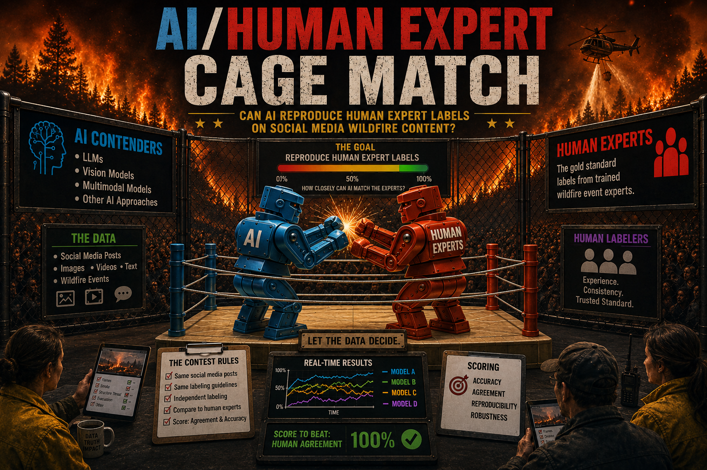
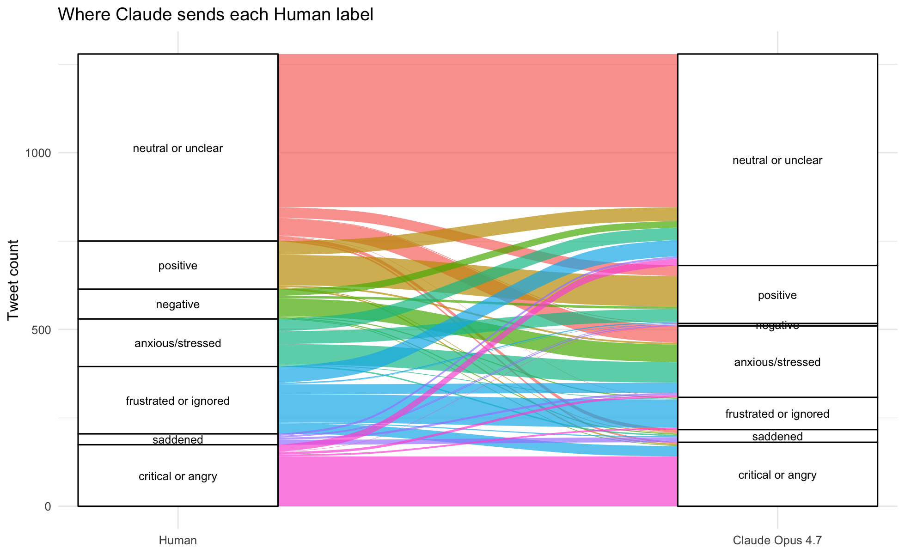
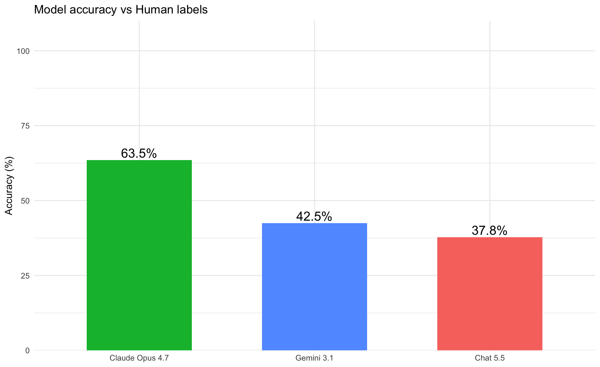
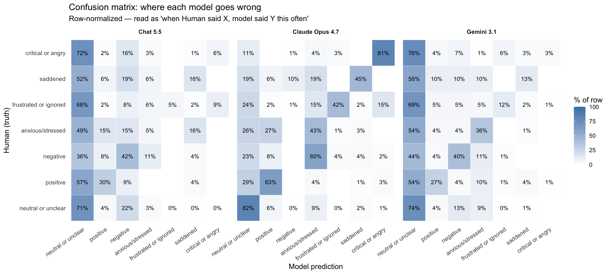
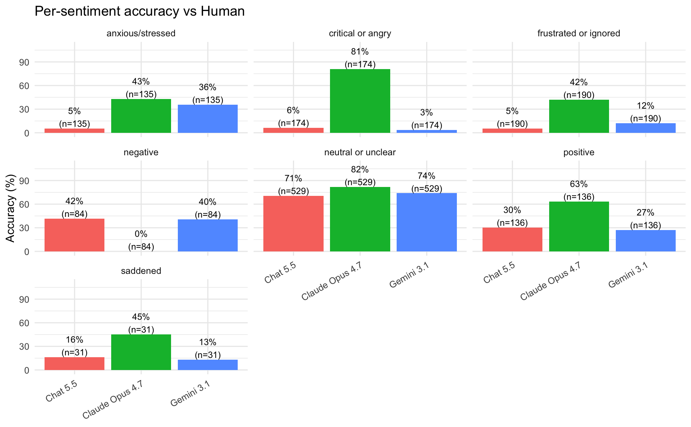

# Using AI to Assess Community Response to Climate Hazards

---
## Day 1
### People
| Name | Affiliation | Contact | Github |
|---|---|---|---|
| Bridger | NSF ASCEND Engine | bridger@innosphere.org | @Innosphere-Bridger |
| Lauren Palermo | CU Boulder / USGS | lapa5054@colorado.edu | @palermolauren |
| Lise St. Denis | CU Boulder / CIRES Earth Lab | lise.st.denis@colorado.edu | @lisestdenis |
| Juan P. Maestre | University of Texas at Austin | juanpedro.maestre@utexas.edu | @drMaestre |
| Luca A Palasti | CU Boulder | luca.palasti@colorado.edu | @lucap1211 |

### Project Goal
Understand how AI-assisted analysis of social media can characterize community and emergency management responses to wildfire events, and whether formal and informal crisis narratives converge or diverge across Twitter.
Central question: How do official and public perceptions of a fire align, and what does convergence or divergence in Twitter narratives tell us about the information ecosystem during a wildfire?
### Brainstorming and Possibilities
- Thematic and sentiment analysis of Twitter data from the Chetco Bar (2017) and Klondike (2018) fires in Oregon
- Compare LLM-generated themes and sentiment against human-coded data from the same corpus
- Explore patterns of convergence and divergence between community members and emergency management personnel
- Extend validated pipeline to a new fire event as a downstream test
- Integrate structured incident data (ICS-209) to compare official fire narrative with public social media narrative
- Consider community characteristics (Social Vulnerability Index, WUI) as contextual variables
- Study area candidates for extension: Turner Gulch, Marshall, and Lower North Fork fires in Colorado
Promising prompting directions:
- Brainstorm things that do not work, studies that aren't mainstream
- Frame the charge question carefully before coding
- Probe "how do we define success in this realm?"
### Team Norms
- You can always pass
- Create a space where everyone feels comfortable contributing
- There are no dumb questions
- "Yes and" language
- Self-organize around what everyone is interested in
- Be explicit with requests
- Be clear about brainstorming versus action
- Use summaries to refine into action steps
**Decision making:** Silent voting for prioritization, everyone has the same number of votes. Clarify intensity of opinion before decisions.
---
## Day 2
### Models Used
| Model | Version | Role |
|---|---|---|
| ChatGPT | GPT-4.5 | Thematic and sentiment classification; community and EM corpora |
| Claude | Claude 4.6 (claude-sonnet-4-6) | Thematic and sentiment classification; community and EM corpora |

### Norms Around AI Use
General comfort with AI-assisted generation, with explicit boundaries:
- **Documentation:** AI outputs must be documented and traceable
- **Domain expertise:** AI suggestions are subject to expert review before acceptance
- **Validation:** Results require validation beyond visual inspection
### Divergent Thinking: Ideas We Explored
- How would one operationalize convergence and divergence between user groups? What are the strengths and blind spots of different approaches?
- Computer-generated theming versus human theming: where do they agree and where do they part ways?
- What does it mean for a pipeline to be "lightly" versus "highly" engineered in terms of prompts, and how much does that matter for outputs?
- Can LLM-coded themes trained on one fire generalize to a different fire in a different geographic and policy context?
- Comparative sentiment by user group: do community members and emergency managers express the same events in emotionally different ways?
### Plan and Subgroups 📣 { #plan .oasis-report-out-section .oasis-report-out-day2 }
**Overall goal:** Produce a reproducible AI-assisted pipeline that codes themes and sentiment from wildfire Twitter data, validates it against human-coded data, and demonstrates its application across multiple fire events and user groups.
| Subgroup | Members | Aim |
|---|---|---|
| Theme prompt engineering | JP, Travis, Lauren, M | Develop and refine LLM prompts for thematic coding; compare lightly vs. highly engineered outputs against human-coded themes |
| Sentiment prompt engineering | Bridger, Branda | Develop and refine LLM prompts for sentiment classification; compare outputs by user group (community vs. EM) |

**Step-by-step plan:**
1. Run thematic and sentiment analysis on Chetco Bar and Klondike data using LLM (lightly engineered prompts)
2. Compare LLM outputs using the same data with highly engineered prompts
3. Compare both LLM outputs against human-coded themes and sentiment as ground truth
4. Apply the validated pipeline to a new fire event (downstream test)
5. Analyze differences between user subgroups and characterize patterns of convergence and divergence
**Data sources in scope:** Scraped Twitter data (Chetco Bar, Klondike), ICS-209 incident reports, Social Vulnerability Index, WUI data.
### Analysis Started
- Inductive thematic analysis completed on combined community (n = 1,279) and emergency management (n = 1,529) tweet corpora
- Seven themes identified: Fire Progression, Evacuation, Smoke/Air Quality, Operational Coordination, Community Solidarity, Geospatial Mapping, and Public Accountability
- Initial comparison of AI-assigned themes against human-coded emerging themes underway (community data only, n = 388 hand-coded tweets)
- R script for human vs. AI theme cross-tabulation drafted and available for review
---
## Day 3
### Findings at a Glance 📣 { #findings .oasis-report-out-section .oasis-report-out-day3 }
**Headline 1 — LLM classifiers converge on fire operations but diverge on public experience.**
Cross-tabulation of 615 tweets classified by both ChatGPT and Claude revealed a strong structural convergence in operationally bounded themes (e.g., "Operational status broadcasting" mapped to "Tracking Fire Scale and Containment Progress" in 167 of 238 cases; "Evacuation and immediate disruption" mapped to "Evacuation Orders and Displacement Experiences" at high frequency), while themes anchored in subjective community experience showed markedly lower inter-classifier agreement. ChatGPT's "Seeking visibility and official action" (n = 771) fragmented across three Claude themes ("Tracking Fire Scale and Containment Progress," "Personal Safety, Proximity, and Local Threat," and "Media Amplification and Information Gaps"), indicating that public accountability discourse is parsed through different conceptual frames depending on the level of prompt engineering. This pattern suggests that structural, information-dense content is more consistently classifiable by LLMs than emotionally or politically inflected content.

**Headline 2 — Sentiment granularity differs substantially across classifiers, with implications for group-level inference.**
ChatGPT applied a 5-category sentiment scheme and classified 64.2% of all tweets as Neutral/Informational, while Claude's 6-category scheme yielded an 84.9% Neutral/Informational rate. This 20-percentage-point gap is not trivially attributable to corpora differences: the two systems classified largely overlapping tweets from the same source groups (emergency response, n = 1,529; community, n = 1,279). Claude's finer scheme captures distinctions absent in ChatGPT's output: "Engaged/Observational" (5.0%), "Grateful/Supportive" (4.8%), and "Frustrated/Critical" (1.7%) represent affective categories that ChatGPT collapses into broader bins. For emergency management applications, this granularity gap matters, as "Engaged/Observational" and "Frustrated/Critical" tweets may encode actionable public signals about information adequacy or institutional trust that coarser schemes suppress.

**Headline 3 — Human inductive themes and AI thematic frameworks show high conceptual alignment for four of seven categories, with notable divergence on public accountability and geospatial content.**
Semantic cross-tabulation of the seven inductively derived human themes against Claude's 10-theme framework (Figure 1) shows strong alignment for Fire Progression (1,226 tweets), Evacuation (616 tweets), Smoke/Air Quality (337 tweets), and Operational Coordination (310 tweets). Human-coded "Public Accountability" maps onto two distinct Claude themes (Institutional Accountability and Crisis Governance, and Media Amplification and Information Gaps), reflecting how AI-generated frameworks tend to separate what human coders treat as a unified accountability discourse. "Geospatial Mapping," a human theme capturing visual information products, aligns cleanly with Claude's "Situational Maps, Photos, and Visual Briefings" (160 tweets), indicating this operationally bounded theme is robustly recoverable across classification methods. These findings support the use of LLM pipelines for high-volume thematic sorting while arguing for human review of politically and emotionally inflected categories.

**Headline 4 — Claude 4.6 achieves substantially higher accuracy than GPT-4.5 against human inductive themes, with both models performing best on operationally defined categories.**
Using the seven inductively derived human themes as a reference standard and applying semantic mapping to align each model's 10-theme output, Claude 4.6 achieved an overall accuracy of 54.0% (691/1,279 community tweets), compared to 29.5% for GPT-4.5 (260/880 matched tweets). Both models performed well on Evacuation (Claude: 90.9%; ChatGPT: 90.0%), Smoke/Air Quality (Claude: 88.5%; ChatGPT: 84.7%), and Public Accountability (Claude: 81.5%; ChatGPT: 92.0%). The largest divergence appeared in Fire Progression, the most frequent human theme (n = 766): Claude captured 36.0% correctly, while ChatGPT captured only 7.9%, largely because ChatGPT's "Seeking visibility and official action" category absorbed the majority of high-volume status-update tweets. ChatGPT scored 0% on Geospatial Mapping and Operational Coordination, indicating these operationally bounded categories are not represented in its thematic framework, whereas Claude's scheme explicitly captures both (Situational Maps: 72.7%; Operational Coordination: 86.7%). These accuracy differentials are consistent with the hypothesis that more granular, domain-anchored prompt engineering yields better alignment with inductively derived human categories.

### Visuals That Tell a Story 📣 { #visuals .oasis-report-out-section .oasis-report-out-day3 }

*Figure 1: Cross-tabulation of the seven inductively derived human themes against Claude 4.6's 10 AI-generated themes (n = 2,808 tweets). Cell values indicate tweet counts under Claude's classification scheme, semantically aligned to each human theme. Strong diagonal density for Fire Progression and Evacuation indicates robust inter-method agreement; split mappings for Public Accountability indicate where AI frameworks partition human-defined constructs. Green-bordered cells mark semantic matches (correct classifications).*

*Figure 2: Side-by-side horizontal bar charts comparing the frequency of all 10 themes assigned by GPT-4.5 (left, n = 2,788) and Claude 4.6 (right, n = 2,808). Both classifiers produce heavily right-skewed distributions dominated by operational update themes, consistent with the EM-heavy composition of the corpus (emergency response n = 1,529; community n = 1,279).*

*Figure 3: Heatmap cross-tabulation of GPT-4.5 (rows) and Claude 4.6 (columns) theme assignments for 615 matched tweets. Cell shading is proportional to tweet count. Near-diagonal concentration for operationally bounded themes (fire status, evacuation, smoke) contrasts with off-diagonal scatter for themes grounded in public voice and accountability, indicating that prompt architecture has the greatest effect on socially complex content.*

*Figure 4: Donut charts comparing the sentiment distributions assigned by GPT-4.5 (5 categories, left) and Claude 4.6 (6 categories, right) across all classified tweets. ChatGPT concentrates 64.2% of tweets in Neutral/Informational; Claude concentrates 84.9%. Claude's additional categories (Engaged/Observational, Frustrated/Critical) capture affective nuance suppressed by ChatGPT's coarser scheme, with potential relevance for public communication monitoring during active fire events.*

**Interactive analysis reports:**
- [Three-Way Thematic Comparison (D3 interactive)](assets/figures/thematic_comparison.html) — Cross-tabulation heatmap, Sankey flow, convergence network, sentiment profiles, and category distributions across GPT-4.5, Claude 4.6, and human source groups.
- [Human Ground Truth Accuracy and Sankey Analysis (D3 interactive)](assets/figures/human_accuracy_sankey.html) — Human themes as ground truth, LLM accuracy by theme, Sankey diagrams (Human → GPT-4.5 and Human → Claude 4.6), per-theme accuracy comparison.
- [Community tweet-level comparison dataset](assets/files/pers_themes_comparison.csv) — 1,279 community tweets with human keyword-coded themes, GPT-4.5 assignments, and Claude 4.6 assignments.

### What's Next? 📣 { #whats-next .oasis-report-out-section .oasis-report-out-day3 }
**Short term:**
- Apply the validated pipeline to a new fire event (Turner Gulch, Marshall, or Lower North Fork, Colorado) to test cross-event generalizability of both the ChatGPT and Claude classification frameworks
- Conduct formal inter-rater reliability analysis (Cohen's kappa or Krippendorff's alpha) on the 615 matched tweets, using human-coded themes as the reference standard, to quantify the comparative accuracy of each LLM approach
- Evaluate the effect of prompt engineering depth on classification agreement by systematically varying instruction specificity (lightly vs. highly engineered prompts) and measuring cross-tabulation alignment with human codes
- Integrate ICS-209 incident report data to compare the official operational narrative with the Twitter-derived community narrative at matched time points during fire progression

**Long term:**
- Develop a reproducible, open-source pipeline (R and Python) that supports multi-event, multi-LLM thematic and sentiment coding of crisis social media, with structured documentation of prompt versions
- Incorporate Social Vulnerability Index and WUI exposure data to examine whether community vulnerability is associated with divergent narrative patterns or sentiment expression
- Extend the analysis to non-English tweets and cross-linguistic fire events to assess whether the thematic framework transfers across language and regulatory contexts
- Publish findings with full data and code availability to support replication and cross-site synthesis

**Who should see this:**
- Emergency managers and public information officers designing social media monitoring protocols for wildfire events
- Researchers applying LLMs to disaster communication, crisis informatics, and environmental risk perception
- Computational social scientists evaluating prompt engineering approaches for thematic coding validity
- FEMA, NIFC, and state emergency management agencies developing AI-assisted situational awareness tools

---
## Cite & Reuse { #cite-reuse }
St. Denis, L., Maestre, J.P., Palermo, L., & Bridger. (2026). *Using AI to Assess Community Response to Climate Hazards — ESIIL Innovation Summit 2026*. https://github.com/CU-ESIIL/Project_group_OASIS
License: CC-BY-4.0 unless noted.
